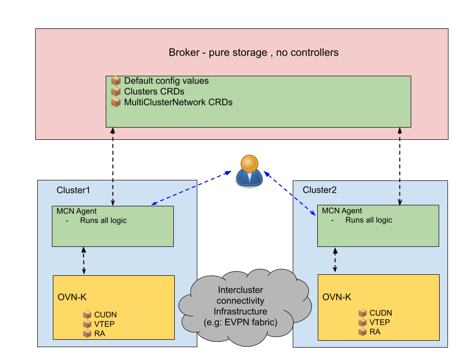

# OKEP-XXXX: Multi-Cluster Networking

* Parent OKEP: [OKEP-XXXX: Multi-Cluster Networking](okep-multi-cluster-networking.md)
* Status: Draft
* Authors: Yossi Boaron (@yboaron)

## Table of Contents

- [Summary](#summary)
- [Overview](#overview)
- [Multi-Cluster Networking (MCN)](#multi-cluster-networking-mcn)
  - [Deployment Model](#deployment-model)
  - [Flow Diagrams](#flow-diagrams)
- [CRD Specifications](#crd-specifications)
  - [Cluster CR](#cluster-cr)
  - [MultiClusterNetwork CR](#multiclusternetwork-cr)
  - [MultiClusterNetworkConnect CR](#multiclusternetworkconnect-cr)
- [Agent Implementation](#agent-implementation)
  - [Broker Syncer](#broker-syncer)
  - [VNI Allocator](#vni-allocator)
  - [CIDR Coordinator](#cidr-coordinator)
  - [VTEP Manager](#vtep-manager)
- [Detailed Workflows](#detailed-workflows)
  - [Layer3 EVPN Network Creation](#layer3-evpn-network-creation)
  - [Layer2 EVPN Network Creation](#layer2-evpn-network-creation)
  - [Cluster Join/Leave](#cluster-joinleave)
- [Error Handling](#error-handling)
- [Testing Strategy](#testing-strategy)
- [API Versioning](#api-versioning)

## Summary

This document provides detailed implementation specifications for Multi-Cluster Networking (MCN), including CRD schemas, agent component design, detailed workflows, and error handling.

## Overview

**Architecture Diagram:**



The diagram illustrates the distributed broker-agent architecture where the broker serves as pure storage (CRDs only, no controllers) and agents on each cluster perform all orchestration logic. Agents coordinate via broker CRDs but operate autonomously. The architecture includes inter-cluster connectivity infrastructure (e.g., EVPN fabric) as a separate logical component.

**Inter-Cluster Infrastructure:**

To stretch networks across clusters, some form of inter-cluster connectivity infrastructure is required. For example, BGP EVPN fabric between clusters can provide the transport layer for stretched networks. To enable end-to-end datapath, OVN-Kubernetes must be configured to route inter-cluster traffic via this infrastructure. For BGP EVPN infrastructure, stretching CUDNs across clusters may be achieved by updating the CUDN's transport section with EVPN configuration details (VNI, route targets, VTEP reference).

Infrastructure as Separate Logical Component - Examples of transport infrastructure types:

1. **BGP EVPN** - BGP peering between cluster nodes for VXLAN tunneling
2. **Encrypted Overlay** - IPsec/WireGuard tunnels between gateway nodes (for internet-facing clusters)

Additional infrastructure solutions can be explored, such as cloud interconnect solutions (e.g., AWS Transit Gateway).

**Note:** The design of the infrastructure component and its integration with MCN and OVN-K datapath is currently an open issue. The initial implementation focuses on BGP EVPN automation, but the architecture should support multiple transport mechanisms.

## Multi-Cluster Networking (MCN)

Multi-Cluster Networking (MCN) is a **separate component** from OVN-Kubernetes that provides orchestration for stretching ClusterUserDefinedNetworks (CUDNs) across multiple independent Kubernetes clusters. MCN does not modify OVN-Kubernetes itself, but rather acts as an orchestration layer on top of it.

**Key Architectural Principles:**

1. **Separate Deployment**: MCN is deployed independently from OVN-Kubernetes. Each cluster runs OVN-K as its CNI, and MCN is optionally deployed to enable multi-cluster networking.

2. **API-Only Integration**: MCN should use OVN-Kubernetes APIs to configure networking primitives:
   - `ClusterUserDefinedNetwork` - For updating stretched networks with EVPN configuration
   - `VTEP` - For VXLAN tunnel endpoint configuration
   - `RouteAdvertisement` - For advertising routes via EVPN
   - MCN should not directly interact with OVN databases or internal OVN-K components

3. **Broker-Agent Pattern**:
   - **Broker**: Lightweight Kubernetes cluster serving as shared storage for MCN CRDs (can be dedicated cluster or one of the managed clusters)
   - **Agent**: Runs on each managed cluster, performs all orchestration logic
   - Agents are autonomous - they coordinate via broker but operate independently

4. **Resource Coordination**: MCN coordinates shared resources across clusters:
   - **VNI Allocation**: Ensures same VXLAN Network Identifier for stretched networks
   - **CIDR Validation**: Validates CUDNs across clusters use non-overlapping IP ranges (Layer3) or coordinates IPAM ranges (Layer2)
   - **ASN Allocation**: Assigns unique BGP ASN per cluster for eBGP peering
   - **VTEP CIDR Allocation**: Allocates non-overlapping VTEP CIDR ranges per cluster

### Deployment Model

**Components:**

- **Broker**: Kubernetes cluster storing MCN CRDs (Cluster, MultiClusterNetwork) and configuration (ASN/VNI/VTEP pools). Can be dedicated cluster or hosted on a member cluster. Pure storage, no controllers.

- **MCN Agent**: Runs on each managed cluster. Performs all orchestration logic (resource allocation, configuration generation, CUDN updates). Syncs with broker via Kubernetes API.

- **Inter-Cluster Infrastructure**: External component providing connectivity between clusters (BGP EVPN fabric, VPN tunnels, overlay networks). Managed separately from MCN.

- **OVN-Kubernetes**: CNI on each cluster. Consumes CUDN/VTEP/RouteAdvertisement resources configured by MCN agent to program data plane.

**Installation Steps:**

1. **Deploy Broker** (one-time):
   - Create dedicated Kubernetes cluster OR use existing member cluster
   - Install MCN CRDs
   - Create MCN ConfigMap with default values (ASN pool, VNI pool, VTEP CIDR pool, Route Target ASN)
   - Configure broker access credentials:
     - Create ServiceAccount for agents
     - Create Role/ClusterRole with permissions to read/write MCN CRDs (Cluster, MultiClusterNetwork)
     - Create RoleBinding to bind ServiceAccount to Role
     - Generate access token or certificate for ServiceAccount
     - Create Secret containing broker API server endpoint and credentials

2. **Deploy Agent per Cluster**:
   - Install MCN agent with broker access configuration (API endpoint, credentials from Secret)
   - Optionally configure agent-specific values:
     - ASN (if not set, auto-allocated from broker default pool)
     - VTEP CIDR (if not set, auto-allocated from broker default pool)
   - Agent automatically:
     - Collects local cluster details (node IPs, configured ASN/VTEP if provided)
     - Registers cluster on broker (creates Cluster CR with ASN/VTEP from config or allocated from broker pools)
     - Creates local VTEP resource
     - Watches for local MultiClusterNetworkConnect CRs
     - When MCNC is created:
       - Queries broker for corresponding MultiClusterNetwork by networkID
       - If MCN exists: Joins existing network (reads VNI, validates CIDR compatibility)
       - If MCN does not exist: Creates new network (allocates VNI from broker pool)

3. **Auto-Allocated Resources** (if not set explicitly by user):
   - **ASN**: Allocated from broker default pool (pool range configurable in broker ConfigMap)
   - **VTEP CIDR**: Allocated from broker default pool (pool range configurable in broker ConfigMap)
   - **VNI**: Allocated on-demand from broker default pool when creating new networks (pool range configurable in broker ConfigMap)
   - **Route Target ASN**: Uses value from broker ConfigMap

### Flow Diagrams

**Diagram 1: MCN/Broker Deployment and Multi-Cluster Setup**

```
User                Broker              Cluster East        Cluster West
  │                    │                      │                   │
  │ 1. Deploy Broker   │                      │                   │
  │ (CRDs+ConfigMap)   │                      │                   │
  ├───────────────────►│                      │                   │
  │                    │                      │                   │
  │ 2. Deploy Agent    │                      │                   │
  ├────────────────────┼─────────────────────►│                   │
  │                    │                      │                   │
  │                    │  3. Collect details  │                   │
  │                    │     (nodes, IPs)     │                   │
  │                    │                      │                   │
  │                    │  4. Register Cluster │                   │
  │                    │◄─────────────────────┤                   │
  │                    │  (Create Cluster CR  │                   │
  │                    │   with ASN, VTEP)    │                   │
  │                    │                      │                   │
  │                    │  5. Create VTEP ─────┼──► OVN-K API      │
  │                    │                      │                   │
  │                    │  6. Update endpoints │                   │
  │                    │◄─────────────────────┤                   │
  │                    │  (Cluster CR status) │                   │
  │                    │                      │                   │
  │ 7. Deploy Agent    │                      │                   │
  ├────────────────────┼──────────────────────┼──────────────────►│
  │                    │                      │                   │
  │                    │                      │  8. Collect details
  │                    │                      │                   │
  │                    │  9. Register Cluster │                   │
  │                    │◄──────────────────────────────────────────┤
  │                    │                      │                   │
  │                    │  10. Create VTEP ────┼──────────────────►│ OVN-K API
  │                    │                      │                   │
  │                    │  11. Update endpoints│                   │
  │                    │◄──────────────────────────────────────────┤
  │                    │                      │                   │
  │                    │  12. Read remote     │  13. Read remote  │
  │                    │      cluster details │      cluster      │
  │                    ├─────────────────────►│      details      │
  │                    ├──────────────────────┼──────────────────►│
  │                    │                      │                   │
  │                    │  14. Configure BGP   │  15. Configure BGP│
  │                    │      neighbors ──────┼──► FRR-K8s        │
  │                    │                      │      neighbors ───┼──► FRR-K8s
  │                    │                      │                   │
  │                    │  16. BGP EVPN Sessions Established       │
  │                    │◄─────────────────────┴───────────────────┤
  │                    │   (Cluster CR status: Ready)             │
```

**Note:** Both clusters are now registered and ready for network stretching. BGP peering is established between nodes across clusters.

---

**Diagram 2: CUDN Network Stretching (Layer3 EVPN)**

```
User (Cluster East)    Cluster East Agent     Broker          Cluster West Agent
  │                           │                  │                    │
  │ 1. Create CUDN            │                  │                    │
  │  (cidr: 10.100.0.0/17)    │                  │                    │
  ├──────────────────────────►│                  │                    │
  │                           │                  │                    │
  │ 2. Create MCNC            │                  │                    │
  │  (networkID: prod-net)    │                  │                    │
  ├──────────────────────────►│                  │                    │
  │                           │                  │                    │
  │                           │ 3. Query MCN     │                    │
  │                           ├─────────────────►│                    │
  │                           │  (not found)     │                    │
  │                           │                  │                    │
  │                           │ 4. Allocate VNI  │                    │
  │                           │ 5. Create MCN    │                    │
  │                           ├─────────────────►│                    │
  │                           │  (vni: 5001)     │                    │
  │                           │                  │                    │
  │                           │ 6. Inject EVPN ──┼───► OVN-K API      │
  │                           │    into CUDN     │                    │
  │                           │                  │                    │
User (Cluster West)           │                  │                    │
  │                           │                  │                    │
  │ 7. Create CUDN            │                  │                    │
  │  (cidr: 10.100.128.0/17)  │                  │                    │
  ├──────────────────────────┼──────────────────┼───────────────────►│
  │                           │                  │                    │
  │ 8. Create MCNC            │                  │                    │
  │  (networkID: prod-net)    │                  │                    │
  ├──────────────────────────┼──────────────────┼───────────────────►│
  │                           │                  │                    │
  │                           │                  │ 9. Query MCN       │
  │                           │                  │◄───────────────────┤
  │                           │                  │  (found, vni:5001) │
  │                           │                  │                    │
  │                           │                  │ 10. Validate CIDR  │
  │                           │                  │  (no overlap ✓)    │
  │                           │                  │                    │
  │                           │                  │ 11. Update MCN     │
  │                           │                  │◄───────────────────┤
  │                           │                  │  (track CIDR)      │
  │                           │                  │                    │
  │                           │                  │ 12. Inject EVPN    │
  │                           │                  ├───► OVN-K API      │
  │                           │                  │  (same VNI: 5001)  │
```

**Key Points:**
- User creates CUDNs with **non-overlapping CIDRs** (user responsibility)
- Agent validates CIDRs don't overlap when joining network
- If overlap detected: MCNC status set to Failed (agent does NOT modify CUDN)
- VNI allocated once by first cluster, reused by subsequent clusters
- CUDN names can differ (app-network vs my-app-net) via `cudnRef.name`

---

## CRD Specifications

### Cluster CR

The `Cluster` CR represents a managed cluster that participates in multi-cluster networking. It is created on the broker cluster.

**Schema:**

```yaml
apiVersion: mcn.ovn.kubernetes.io/v1alpha1
kind: Cluster
metadata:
  name: cluster-east  # Cluster identifier
spec:
  clusterID: "cluster-east-12345"  # Unique cluster ID (UUID)
  asn: 64512  # BGP ASN allocated to this cluster
  vtepCIDR: "100.0.0.0/30"  # VTEP IP range for this cluster
  
status:
  endpoints:  # Node endpoints for BGP peering (any nodes with FRR pods)
    - ip: "10.0.1.100"
      nodeName: "worker-node-1"
    - ip: "10.0.1.101"
      nodeName: "worker-node-2"
  conditions:
    - type: Ready
      status: "True"
      lastTransitionTime: "2025-05-25T10:00:00Z"
```

**Field Descriptions:**

- `spec.clusterID`: Unique identifier for the cluster (generated by agent on first registration)
- `spec.asn`: BGP Autonomous System Number allocated from broker's ASN pool
- `spec.vtepCIDR`: CIDR range for VTEP tunnel endpoint IPs
- `status.endpoints`: List of node endpoints that participate in inter-cluster BGP peering (any nodes running FRR pods)
- `status.conditions`: Cluster readiness status

**Validation:**
- ASN must be unique across all clusters
- VTEP CIDR must not overlap with other clusters' VTEP CIDRs
- ClusterID must be immutable once set

---

### MultiClusterNetwork CR

The `MultiClusterNetwork` CR represents a stretched network across multiple clusters. It is created on the broker cluster.

**Schema:**

```yaml
apiVersion: mcn.ovn.kubernetes.io/v1alpha1
kind: MultiClusterNetwork
metadata:
  name: app-network-l3
spec:
  vni: 5001  # VXLAN Network Identifier
  routeTarget: "65000:5001"  # BGP Route Target (format: ASN:VNI)
  topology: Layer3  # Layer3 or Layer2
  
  # Layer3 configuration (agent-managed tracking)
  layer3:
    cidrAllocations:  # Agent-managed: tracks each cluster's CUDN CIDR for validation
      cluster-east: "10.100.0.0/17"
      cluster-west: "10.100.128.0/17"
  
  # Layer2 configuration (mutually exclusive with layer3)
  # layer2:
  #   cidr: "192.168.1.0/24"  # Shared CIDR across all clusters
  #   ipamAllocations:  # Agent-managed: coordinates IPAM ranges to prevent conflicts
  #     cluster-east: "192.168.1.1-192.168.1.127"
  #     cluster-west: "192.168.1.128-192.168.1.254"
  
status:
  participatingClusters:
    - clusterName: cluster-east
      cudnName: app-network  # Local CUDN name on cluster-east
      status: Ready
    - clusterName: cluster-west
      cudnName: my-app-net  # Local CUDN name on cluster-west (can differ!)
      status: Ready
  conditions:
    - type: Ready
      status: "True"
```

**Field Descriptions:**

- `spec.vni`: VXLAN Network Identifier, allocated by agent from broker pool when creating new network
- `spec.routeTarget`: BGP EVPN Route Target in format `<ASN>:<VNI>` (ASN from broker ConfigMap)
- `spec.topology`: Network topology (Layer3 for routed, Layer2 for switched)
- `spec.layer3.cidrAllocations`: **Agent-managed field** that tracks each cluster's CUDN CIDR for overlap validation. Agents update this when joining network.
- `spec.layer2.ipamAllocations`: **Agent-managed field** that coordinates IPAM ranges across clusters to prevent IP conflicts
- `status.participatingClusters`: List of clusters that have joined this network
  - `cudnName`: Local CUDN name on each cluster (can differ across clusters - no naming requirement)

**Validation:**
- VNI must be unique across all MultiClusterNetworks
- For Layer3: cidrAllocations must not overlap (agent validates when cluster joins)
- For Layer2: ipamAllocations must not overlap
- Topology is immutable once set

**User Responsibility (Distributed Model):**
- Users must create CUDNs on each cluster with **non-overlapping CIDRs** (for Layer3)
- Agent validates CIDR doesn't overlap with existing allocations when joining network
- If overlap detected: MCNC status set to Failed, agent does **not** modify user's CUDN
- `cidrAllocations` field is for agent coordination/validation only, **not user input**

**CUDN Name Flexibility:**

MCN does **not require** CUDNs to have the same name across clusters. Each cluster can use different local CUDN names:

- **cluster-east** can have CUDN named `app-network`
- **cluster-west** can have CUDN named `my-app-net`
- Both CUDNs participate in the same `MultiClusterNetwork`

The mapping is tracked in `status.participatingClusters[].cudnName`. This is configured via `MultiClusterNetworkConnect.spec.cudnRef.name`, which references the local CUDN name on each cluster.

**Example:**
```yaml
# On cluster-east
apiVersion: mcn.ovn.kubernetes.io/v1alpha1
kind: MultiClusterNetworkConnect
spec:
  cudnRef:
    name: app-network  # Local CUDN name
  networkID: "shared-net"  # Shared network identifier

# On cluster-west
apiVersion: mcn.ovn.kubernetes.io/v1alpha1
kind: MultiClusterNetworkConnect
spec:
  cudnRef:
    name: my-app-net  # Different local CUDN name
  networkID: "shared-net"  # Same network identifier
```

---

### MultiClusterNetworkConnect CR

The `MultiClusterNetworkConnect` CR is created on a managed cluster to connect a local CUDN to a multi-cluster network.

**Schema:**

```yaml
apiVersion: mcn.ovn.kubernetes.io/v1alpha1
kind: MultiClusterNetworkConnect
metadata:
  name: app-network-connect
spec:
  cudnRef:
    name: app-network  # Reference to existing local CUDN
  
  networkID: "prod-app-network"  # Shared network identifier across clusters
  
status:
  phase: Pending | Ready | Failed
  allocatedVNI: 5001
  allocatedCIDR: "10.100.0.0/17"  # For Layer3
  multiClusterNetworkName: "prod-app-network"  # MCN CR name on broker
  conditions:
    - type: CUDNFound
      status: "True"
    - type: CUDNCompatible
      status: "True"
      message: "CUDN topology and CIDR match network requirements"
    - type: EVPNConfigured
      status: "True"
      message: "Transport and EVPN section injected into CUDN"
    - type: MultiClusterNetworkReady
      status: "True"
    - type: BGPPeeringEstablished
      status: "True"
```

**Field Descriptions:**

- `spec.cudnRef.name`: Reference to existing ClusterUserDefinedNetwork on local cluster (must exist before creating MCNC)
- `spec.networkID`: User-defined network identifier that must match across all clusters participating in the same multi-cluster network
- `status.phase`: Current phase of the connection (Pending, Ready, Failed)
- `status.allocatedVNI`: VNI allocated by agent (auto-allocated if first cluster, read from broker if joining)
- `status.allocatedCIDR`: CIDR from the referenced CUDN (user-provided, validated by agent)
- `status.multiClusterNetworkName`: Name of the MultiClusterNetwork CR on broker (typically same as networkID)
- `status.conditions`: Detailed status of configuration steps

**Important Design Points:**

1. **No Role Field**: Agent automatically determines if it's creating a new network or joining existing based on broker state
2. **No CIDR Field**: Agent reads CIDR configuration from the referenced CUDN
3. **CUDN Must Exist First**: User creates CUDN with basic config (topology, CIDR, role), then creates MCNC
4. **Agent Injects EVPN**: Agent updates CUDN by injecting entire `transport: EVPN` section with VNI, RouteTarget, and VTEP reference

**Validation:**
- CUDN must exist before creating MultiClusterNetworkConnect
- CUDN must NOT have transport or EVPN configured (agent manages this)
- If joining existing network: CUDN topology and CIDR must match existing MultiClusterNetwork
- NetworkID must be a valid DNS label

---

## Agent Implementation

### Broker Syncer

**Responsibility:** Bidirectional synchronization between local cluster and broker.

**Implementation Details:**
- Uses Submariner Admiral syncer for reliable watch/sync
- Syncs Cluster CR status (endpoints) from local → broker
- Watches MultiClusterNetwork CRs from broker → local
- Implements exponential backoff for broker connectivity failures
- Handles broker unavailability gracefully (continues with cached state)

**Key Functions:**
```go
// SyncClusterStatus updates local cluster's status on broker
func (bs *BrokerSyncer) SyncClusterStatus(endpoints []Endpoint) error

// WatchMultiClusterNetworks watches for MCN updates from broker
func (bs *BrokerSyncer) WatchMultiClusterNetworks(handler func(*MultiClusterNetwork)) error
```

---

### VNI Allocator

**Responsibility:** Allocate unique VNI from broker's global pool.

**Algorithm:**
1. Read all existing MultiClusterNetwork CRs from broker
2. Find first available VNI in range 5000-10000
3. Optimistically create/update MultiClusterNetwork with allocated VNI
4. If conflict (another cluster allocated same VNI), retry with next available VNI

**VNI Range:** 5000-10000 (5000 VNIs available)

**Route Target Generation:** `65000:<VNI>` (fixed ASN 65000)

**Key Functions:**
```go
// AllocateVNI allocates a VNI and returns VNI + RouteTarget
func (va *VNIAllocator) AllocateVNI(mcnName string) (int32, string, error)
```

**Error Handling:**
- VNI pool exhaustion: Return error to user
- Optimistic locking conflicts: Retry with exponential backoff (max 5 attempts)

---

### CIDR Coordinator

**Responsibility:** Validate CIDR allocation across clusters by reading user-provided CIDR from local CUDN and ensuring no overlap with existing clusters.

**Layer3 CIDR Validation:**

Users create CUDNs on each cluster with **non-overlapping CIDRs** (user responsibility).

Agent validates CIDR doesn't overlap:
1. Read CIDR from local CUDN (spec.network.layer3.subnets[0].cidr)
2. Query broker for MultiClusterNetwork with matching `networkID`
3. If **not found**: Agent is first cluster, creates MCN and records CIDR in cidrAllocations
4. If **found**: Agent validates CIDR doesn't overlap with existing cidrAllocations
5. If overlap detected: Update MCNC status to Failed (agent does NOT modify CUDN)
6. If no overlap: Update MultiClusterNetwork.spec.layer3.cidrAllocations with this cluster's CIDR

Example: Users create CUDNs with non-overlapping CIDRs:
- Cluster1: User creates CUDN with `10.100.0.0/17` (10.100.0.0 - 10.100.127.255)
- Cluster2: User creates CUDN with `10.100.128.0/17` (10.100.128.0 - 10.100.255.255)
- Agent on Cluster2 validates 10.100.128.0/17 doesn't overlap with Cluster1's 10.100.0.0/17 ✅

**Layer2 IPAM Coordination:**

Use `reservedSubnets` field in CUDN to prevent IP conflicts:
- Cluster1: IPAM range .1-.127, reserves .128-.254
- Cluster2: IPAM range .128-.254, reserves .1-.127

**Key Functions:**
```go
// ValidateCIDR validates user-provided CUDN CIDR doesn't overlap with existing allocations
func (cc *CIDRCoordinator) ValidateCIDR(cudnCIDR string, mcn *MultiClusterNetwork) error

// GenerateReservedSubnets generates reservedSubnets for Layer2
func (cc *CIDRCoordinator) GenerateReservedSubnets(mcn *MultiClusterNetwork, clusterName string) ([]string, error)
```

---

### VTEP Manager

**Responsibility:** Manage local VTEP and discover remote cluster VTEPs.

**Local VTEP Creation:**
```yaml
apiVersion: k8s.ovn.org/v1
kind: VTEP
metadata:
  name: mcn-vtep
spec:
  cidrs: ["100.0.0.0/16"]  # Global VTEP CIDR pool
  mode: Managed  # OVN-K manages VTEP IPs
```

**Remote VTEP Discovery:**
- Watch Cluster CRs on broker for endpoint updates
- Create local routing configuration for remote VTEPs
- Update FRRConfiguration with remote BGP neighbors

---

---

## Detailed Workflows

### Layer3 EVPN Network Creation

**Scenario:** User creates CUDN on cluster-east and cluster-west, wants to stretch as Layer3 network.

**Steps:**

1. **On cluster-east:**
   ```bash
   # Step 1: User creates CUDN with non-overlapping CIDR (user's responsibility)
   kubectl apply -f - <<EOF
   apiVersion: k8s.ovn.org/v1
   kind: ClusterUserDefinedNetwork
   metadata:
     name: app-network
   spec:
     network:
       topology: Layer3
       layer3:
         role: Primary
         subnets:
         - cidr: "10.100.0.0/17"  # User chose non-overlapping CIDR
         mtu: 1400
         hostSubnet: 24
     # NO transport field - agent will inject it
     # NO evpn section - agent will inject it
   EOF
   
   # Step 2: User creates MultiClusterNetworkConnect to enable multi-cluster
   kubectl apply -f - <<EOF
   apiVersion: mcn.ovn.kubernetes.io/v1alpha1
   kind: MultiClusterNetworkConnect
   metadata:
     name: app-network-connect
   spec:
     cudnRef:
       name: app-network  # Reference to existing CUDN
     networkID: "prod-app-network"  # Shared network identifier
   EOF
   ```

2. **Agent on cluster-east:**
   - Validates CUDN exists and has no transport/EVPN configured
   - Reads CUDN config: topology=Layer3, CIDR=10.100.0.0/17
   - Queries broker: `GET MultiClusterNetwork "prod-app-network"` → **Not Found (404)**
   - Determines: I'm first cluster (creating new network)
   - Allocates VNI: 5001
   - Generates RouteTarget: "65000:5001"
   - Creates MultiClusterNetwork on broker:
     ```yaml
     apiVersion: mcn.ovn.kubernetes.io/v1alpha1
     kind: MultiClusterNetwork
     metadata:
       name: prod-app-network
     spec:
       vni: 5001
       routeTarget: "65000:5001"
       topology: Layer3
       transport: EVPN
       layer3:
         cidrAllocations:  # Track for validation
           cluster-east: "10.100.0.0/17"
     ```
   - **UPDATES local CUDN (injects entire EVPN section, CIDR unchanged):**
     ```yaml
     apiVersion: k8s.ovn.org/v1
     kind: ClusterUserDefinedNetwork
     metadata:
       name: app-network
       annotations:
         mcn.ovn.kubernetes.io/network-id: "prod-app-network"
         mcn.ovn.kubernetes.io/managed-by: "mcn-agent"
     spec:
       network:
         topology: Layer3
         layer3:
           role: Primary
           subnets:
           - cidr: "10.100.0.0/17"  # ← UNCHANGED (user provided this)
           mtu: 1400
           hostSubnet: 24
         
         # ← ENTIRE SECTION BELOW INJECTED BY AGENT
         transport: EVPN
         evpn:
           vtep: mcn-vtep
           ipVRF:
             vni: 5001
             routeTarget: "65000:5001"
     ```
   - Creates RouteAdvertisement CRs for local subnets

3. **On cluster-west:**
   ```bash
   # Step 1: User creates CUDN with non-overlapping CIDR (user's responsibility)
   kubectl apply -f - <<EOF
   apiVersion: k8s.ovn.org/v1
   kind: ClusterUserDefinedNetwork
   metadata:
     name: my-app-net  # Different CUDN name than cluster-east
   spec:
     network:
       topology: Layer3  # MUST match cluster-east
       layer3:
         role: Primary
         subnets:
         - cidr: "10.100.128.0/17"  # Different non-overlapping CIDR
         mtu: 1500  # Can differ
     # NO transport or EVPN fields
   EOF
   
   # Step 2: User creates MultiClusterNetworkConnect
   kubectl apply -f - <<EOF
   apiVersion: mcn.ovn.kubernetes.io/v1alpha1
   kind: MultiClusterNetworkConnect
   metadata:
     name: my-app-connect
   spec:
     cudnRef:
       name: my-app-net  # Different CUDN name
     networkID: "prod-app-network"  # SAME network identifier
   EOF
   ```

4. **Agent on cluster-west:**
   - Validates CUDN exists and has no transport/EVPN configured
   - Reads CUDN config: topology=Layer3, CIDR=10.100.128.0/17
   - Queries broker: `GET MultiClusterNetwork "prod-app-network"` → **Found (200)**
   - Reads existing network config:
     ```yaml
     spec:
       vni: 5001  # Already allocated
       topology: Layer3
       transport: EVPN
       layer3:
         cidrAllocations:
           cluster-east: "10.100.0.0/17"
     ```
   - Validates compatibility:
     - ✅ CUDN.topology (Layer3) == MCN.topology (Layer3)
     - ✅ CUDN.cidr (10.100.128.0/17) does NOT overlap with existing allocations
   - Updates MultiClusterNetwork on broker (adds cluster-west CIDR for tracking):
     ```yaml
     spec:
       layer3:
         cidrAllocations:
           cluster-east: "10.100.0.0/17"
           cluster-west: "10.100.128.0/17"  # ADDED
     status:
       participatingClusters:
         - clusterName: cluster-east
           cudnName: app-network
         - clusterName: cluster-west
           cudnName: my-app-net  # Different CUDN name tracked
     ```
   - **UPDATES local CUDN (injects entire EVPN section, CIDR unchanged):**
     ```yaml
     apiVersion: k8s.ovn.org/v1
     kind: ClusterUserDefinedNetwork
     metadata:
       name: my-app-net
       annotations:
         mcn.ovn.kubernetes.io/network-id: "prod-app-network"
     spec:
       network:
         topology: Layer3
         layer3:
           subnets:
           - cidr: "10.100.128.0/17"  # ← UNCHANGED (user provided this)
           mtu: 1500
         
         # ← ENTIRE SECTION BELOW INJECTED BY AGENT
         transport: EVPN
         evpn:
           vtep: mcn-vtep
           ipVRF:
             vni: 5001  # Same VNI as cluster-east
             routeTarget: "65000:5001"  # Same RT
     ```
   - Creates RouteAdvertisement CRs

5. **Both agents:**
   - Discover remote cluster endpoints from Cluster CRs on broker
   - Create FRRConfiguration with BGP neighbors
   - BGP sessions established, EVPN routes exchanged

**Result:** Pods on cluster-east using CUDN `app-network` (10.100.0.x) can communicate with pods on cluster-west using CUDN `my-app-net` (10.100.128.x) via EVPN.

**Key Points:**
- CUDN names differ (`app-network` vs `my-app-net`) - no naming coordination required
- Both participate in same network via shared `networkID: "prod-app-network"`
- Agent injects entire EVPN configuration - users never touch transport/EVPN fields
- No role field - agent automatically determines create vs join based on broker state

---

### Layer2 EVPN Network Creation

**Scenario:** User creates Layer2 CUDN for VM migration use case.

**Differences from Layer3:**
- Same CIDR used on all clusters (`192.168.1.0/24`)
- IPAM ranges coordinated to prevent IP conflicts
- Each cluster reserves other clusters' IPAM ranges using `reservedSubnets`

**CUDN Configuration on cluster-east:**
```yaml
apiVersion: k8s.ovn.org/v1
kind: ClusterUserDefinedNetwork
metadata:
  name: vm-network
spec:
  network:
    topology: Layer2
    layer2:
      role: Primary
      subnets: ["192.168.1.0/24"]
      ipam:
        mode: Enabled
        lifecycle: Persistent  # Required for VM migration
      reservedSubnets: ["192.168.1.128/25"]  # Cluster-west's range
```

**CUDN Configuration on cluster-west:**
```yaml
spec:
  network:
    topology: Layer2
    layer2:
      subnets: ["192.168.1.0/24"]  # Same CIDR
      ipam:
        mode: Enabled
        lifecycle: Persistent
      reservedSubnets: ["192.168.1.0/25"]  # Cluster-east's range
```

**Result:** VMs can be live migrated between clusters while preserving IP/MAC addresses.

---

### Cluster Join/Leave

**Cluster Join:**
1. Agent registers cluster by creating Cluster CR on broker
2. Agent watches for MultiClusterNetwork CRs
3. User creates MultiClusterNetworkConnect (Joiner role) to join existing networks

**Cluster Leave:**
1. User deletes MultiClusterNetworkConnect
2. Agent removes local CUDN configuration (VNI, RouteAdvertisement)
3. Agent updates MultiClusterNetwork on broker (removes from participatingClusters)
4. Agent removes FRRConfiguration (BGP sessions)
5. If last cluster leaves: MultiClusterNetwork can be deleted

**Graceful Degradation:**
- If broker becomes unavailable, existing stretched networks continue to function
- Agents operate with cached broker state
- New network creation/joins blocked until broker returns

---

## Error Handling

### VNI Pool Exhaustion
**Scenario:** All VNIs (5000-10000) are allocated.  
**Handling:** Agent returns error to user, updates MultiClusterNetworkConnect status with error condition.  
**Mitigation:** Document VNI limits, support VNI reclamation from deleted networks.

### CIDR Conflicts
**Scenario:** User requests overlapping CIDR on different clusters.  
**Handling:** Agent validates CIDR doesn't overlap with existing allocations before updating broker.  
**Error:** Update MultiClusterNetworkConnect status with validation error.

### Broker Unavailability
**Scenario:** Broker cluster becomes unreachable.  
**Handling:**
- Agents continue operating with cached state
- Existing stretched networks remain functional
- New network creation returns error "broker unavailable"
- Agents implement exponential backoff for reconnection attempts

### Agent Failure/Recovery
**Scenario:** Agent pod crashes and restarts.  
**Handling:**
- Agent reconciles state from broker on startup
- Compares local CUDN/VTEP configuration with MultiClusterNetwork state
- Repairs any drift (missing VNI, incorrect CIDR, missing BGP config)

### BGP Session Failures
**Scenario:** BGP session between clusters goes down.  
**Handling:**
- FRR handles automatic reconnection
- Agent monitors BGP session status via FRR metrics
- Updates MultiClusterNetworkConnect status condition "BGPPeeringEstablished"

---

## Testing Strategy

### Unit Tests
- VNI allocator: allocation logic, conflict resolution, pool exhaustion
- CIDR coordinator: overlap validation, Layer2 reserved subnets calculation
- CRD validation: schema validation, immutability checks

### E2E Tests

**Test 1: Layer3 Two-Cluster Connectivity**
1. Create 2 Kind clusters with OVN-K
2. Deploy broker on cluster1
3. Deploy agents on both clusters
4. Create CUDNs and MultiClusterNetworkConnect on both
5. Verify: Pods can ping across clusters
6. Verify: BGP sessions established
7. Verify: EVPN routes present in FRR

**Test 2: Layer2 VM Migration**
1. Create 2 clusters with KubeVirt
2. Create Layer2 stretched network
3. Deploy VM on cluster1 with static IP
4. Live migrate VM to cluster2
5. Verify: IP/MAC preserved
6. Verify: Network connectivity maintained during migration

**Test 3: Cluster Join/Leave**
1. Create 2-cluster stretched network
2. Add 3rd cluster dynamically (user creates CUDN with non-overlapping CIDR)
3. Verify: 3rd cluster CIDR validated successfully (no overlap)
4. Verify: BGP sessions established with existing clusters
5. Remove 2nd cluster
6. Verify: Network continues functioning with cluster1 and cluster3

**Test 4: Broker Failure Recovery**
1. Create stretched network
2. Stop broker cluster
3. Verify: Existing pod-to-pod connectivity continues
4. Verify: New network creation fails gracefully
5. Restart broker
6. Verify: Agents reconnect and sync state

### Scale Testing
- 10 clusters participating in single stretched network
- 100 stretched networks on single broker
- 1000 pods per cluster on stretched network

---

## API Versioning

**Version:** `v1alpha1`

**Stability:** Alpha (APIs may change, no compatibility guarantees)

**Future Versions:**
- `v1beta1`: Stabilize CRD schemas, add comprehensive validation webhooks
- `v1`: GA release, full backwards compatibility guarantees

**Upgrade Path:**
- CRD conversion webhooks will handle v1alpha1 → v1beta1 migration
- Agents must support N-1 version compatibility (e.g., v1beta1 agent can read v1alpha1 CRs)

---

## References

- Parent OKEP: [OKEP-XXXX: Multi-Cluster Networking](okep-multi-cluster-networking.md)
- OVN-Kubernetes EVPN: [OKEP-5088](okep-5088-evpn.md)
- Proof of Concept: [ovn-bgp-mcn-udn-poc](https://github.com/yboaron/ovn-bgp-mcn-udn-poc)
- Submariner Admiral: [admiral](https://github.com/submariner-io/admiral)
