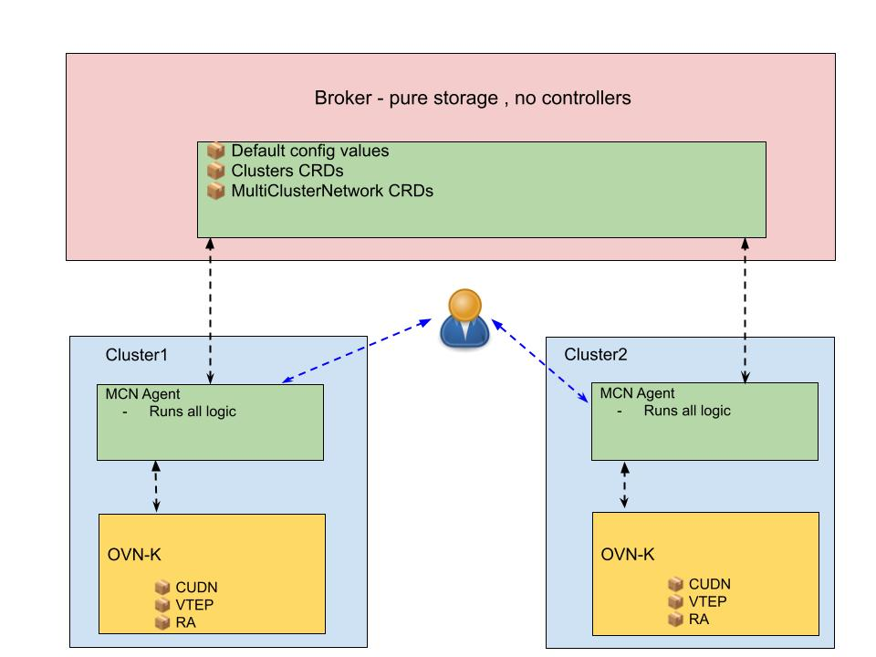

# OKEP-XXXX: Multi-Cluster Networking for ClusterUserDefinedNetworks

* Issue: [#XXXX](https://github.com/ovn-kubernetes/ovn-kubernetes/issues/XXXX)
* Status: Provisional
* Proposed Repository: `ovn-kubernetes/ovnk-mcn`

## Problem Statement

Organizations need to stretch ClusterUserDefinedNetworks (CUDNs) across multiple Kubernetes clusters to enable pod-to-pod connectivity for multi-cluster applications, VM migration scenarios, and hybrid cloud deployments. Current OVN-Kubernetes EVPN support enables connectivity between a single cluster and external networks, but lacks the orchestration layer to coordinate CUDN stretching across multiple independent Kubernetes clusters. While manual configuration is possible, it is error-prone and requires careful synchronization of VNI allocation, CIDR planning, VTEP discovery, and BGP configuration across all clusters.

## Goals

* Enable Layer3 EVPN CUDN stretching across multiple Kubernetes clusters for routed pod-to-pod connectivity
* Enable Layer2 EVPN CUDN stretching across multiple Kubernetes clusters to support VM migration use cases
* Coordinate CIDR allocation across clusters to prevent IP conflicts
* Coordinate IPAM for Layer2 networks to enable shared broadcast domains
* Leverage existing OVN-Kubernetes EVPN and VTEP infrastructure
* Support trusted inter-cluster networks
* Establish new repository under `ovn-kubernetes` organization for multi-cluster orchestration

## Non-Goals

* Stretching the default pod network across clusters
* Multi-cluster service discovery and DNS support
* Pod-to-service connectivity across clusters
* Untrusted network support (public internet) - deferred to Phase 2
* Multi-cluster ingress or load balancing
* Support for CUDN with transport other than EVPN

## Introduction

OVN-Kubernetes supports EVPN transport for ClusterUserDefinedNetworks (see [OKEP-5088](okep-5088-evpn.md)), enabling integration with external EVPN fabrics. This allows a single cluster to extend Layer2 or Layer3 UDNs to external networks (provider networks, VMs, physical hosts).

Cluster-to-cluster scenarios can be implemented manually today by administrators creating CUDNs on each cluster with careful coordination: ensuring the same VNI is used across clusters, planning non-overlapping CIDRs (for Layer3) or shared CIDRs with split IPAM ranges (for Layer2), configuring VTEPs, and establishing BGP EVPN peering. However, this manual approach is error-prone, difficult to maintain as clusters scale, and requires deep networking expertise.

Multi-cluster networking (MCN) automates and orchestrates this process across **cluster-to-cluster** scenarios, where multiple Kubernetes clusters need to share networks. MCN provides declarative user-facing APIs (e.g., "I want to stretch this network") and automated coordination of VNI allocation, CIDR management, VTEP discovery, and BGP configuration. Use cases include:

- **Multi-cluster applications:** Microservices deployed across clusters
- **VM migration:** Live migration of VMs between clusters (requires Layer2 shared broadcast domain)
- **Hybrid cloud:** Seamless connectivity between on-prem and cloud Kubernetes clusters *(Note: Full hybrid cloud support across untrusted networks will be available in Phase 2)*
- **Disaster recovery:** Active-active or active-passive cluster deployments with shared networks

### Why a Separate Repository?

MCN is a **logical orchestration layer that runs on top of OVN-Kubernetes**. It does not modify OVN-K itself, but rather:
- Syncs multi-cluster network state across clusters via a broker
- Uses existing OVN-Kubernetes APIs (CUDN, VTEP, RouteAdvertisement) to configure networking on each cluster
- Coordinates resources (VNI, CIDR, ASN) and shares remote cluster node details to ensure consistency across the multi-cluster setup

This orchestration layer is logically separate from OVN-Kubernetes CNI functionality and benefits from a dedicated repository:

- **Independent release cycle** from OVN-Kubernetes core
- **Dedicated issue tracking** for multi-cluster features
- **Clear separation of concerns:** CNI implementation (OVN-K) vs multi-cluster orchestration (MCN)
- **Easier integration testing** across multiple clusters
- **No OVN-K modifications required:** MCN consumes OVN-K APIs as-is

Proposed repository name: **`ovn-kubernetes/ovnk-mcn`** (alternatives: `mcn`, `ovn-mcn`, `ovn-kubernetes-mcn`)

## User-Stories/Use-Cases

### Use Case 1: Layer3 EVPN - Multi-Region Microservices

**As a** platform engineer deploying microservices across regions  
**I want** to stretch a CUDN across clusters in different regions  
**So that** pods can communicate directly via pod IPs without complex service mesh overlays

**Example:** E-commerce application with order-service in us-east cluster and inventory-service in eu-west cluster, both on `app-network` (10.100.0.0/16) with VNI isolation.

**Requirements:**
- Layer3 routed connectivity (no broadcast domain needed)
- Non-overlapping CIDR allocation across clusters
- VNI-based network isolation

### Use Case 2: Layer2 EVPN - VM Live Migration

**As a** virtualization platform operator using KubeVirt  
**I want** to live migrate VMs between clusters  
**So that** I can perform cluster maintenance or disaster recovery without downtime

**Example:** VM running on cluster1 needs to migrate to cluster2 while preserving IP address (192.168.1.10) and MAC address.

**Requirements:**
- Layer2 shared broadcast domain (ARP works across clusters)
- Same CIDR on all clusters (192.168.1.0/24)
- Coordinated IPAM to prevent IP conflicts
- Persistent IP allocation (IPAMClaim CRDs)

## Proposed Solution

> **Note:** This OKEP provides a high-level architecture overview and requests approval for creating a new repository. Detailed API specifications, CRD schemas, packet flows, and implementation details will be provided in a follow-up KEP.

MCN introduces a **broker-agent architecture** for multi-cluster orchestration, where the broker acts as a **shared storage layer** and agents handle all orchestration logic. The broker can run on a dedicated cluster or be hosted on one of the participating clusters.

### Architecture Overview

**Components:**

1. **Broker Cluster**
   - Lightweight Kubernetes cluster serving as shared state storage
   - Hosts MCN CRDs: `Cluster`, `MultiClusterNetwork`
   - No controllers or orchestration logic
   - Provides API server for agents to read/write cluster state

2. **Agent (per cluster)**
   - Runs on each managed cluster
   - Performs all orchestration: VNI allocation, CIDR coordination, VTEP discovery, BGP configuration
   - Watches broker for multi-cluster network definitions
   - Creates local OVN-Kubernetes resources (CUDN, VTEP, RouteAdvertisement)
   - Independent operation - no dependencies on broker availability after initial sync

**Network Connectivity:**
- Managed clusters → Broker cluster (read/write CRs)
- No broker → managed cluster access required
- Clusters communicate via BGP EVPN over trusted network (VPN/VPC peering)

**Workflow Example (Layer3 EVPN):**

1. User creates CUDN on each cluster with desired CIDR range
2. User creates `MultiClusterNetworkConnect` on **any cluster** referencing local CUDN
3. Agent on that cluster:
   - Allocates VNI from broker (optimistic locking)
   - Validates/splits CIDR to prevent overlap
   - Updates `MultiClusterNetwork` on broker with VNI and CIDR allocation
   - Creates local VTEP and RouteAdvertisement
4. Agents on other clusters (watching broker):
   - Detect new `MultiClusterNetwork`
   - Read CIDR allocation and VNI
   - Create local CUDN with allocated CIDR
   - Create local VTEP and RouteAdvertisement
5. All agents configure BGP EVPN peering between cluster endpoints

**Benefits of this approach:**
- Simple broker (just Kubernetes API + CRDs)
- Agents are independent and resilient
- No single point of failure
- Proven in MCN PoC
- Minimal broker infrastructure requirements

### Multi-Cluster Coordination

**MCN coordinates the following across clusters:**

- **VNI Allocation:** Ensures same VNI is used across all clusters in the stretched network
- **CIDR Allocation:** 
  - Layer3: Splits user-provided CIDR into non-overlapping subnets per cluster
  - Layer2: Uses same CIDR across clusters with IPAM range coordination
- **ASN Allocation:** Assigns unique BGP ASN per cluster for eBGP peering
- **VTEP Discovery:** Discovers and shares tunnel endpoint IPs across clusters
- **BGP Configuration:** Establishes BGP sessions between cluster endpoints

**OVN-Kubernetes API Integration:**

MCN leverages existing OVN-Kubernetes APIs (CUDN, VTEP, RouteAdvertisement) and operates as an independent orchestration layer. New OVN-K APIs may be required to support multi-cluster scenarios (e.g., configuring details of remote cluster nodes for VTEP peering). Specific API requirements will be detailed in the follow-up KEP.

**Note:** Detailed API specifications, CRD schemas, and implementation workflows will be provided in a follow-up KEP.

### Implementation Approach

**Phase 1 Scope:**
- Layer3 EVPN with trusted networks
- Layer2 EVPN with IPAM coordination

### Testing Strategy

**E2E Testing:**
- Layer3: Cross-cluster pod-to-pod connectivity
- Layer2: VM migration scenarios with IP/MAC preservation
- Gateway failover and HA verification

**Scale Testing:**
- Multi-cluster deployments (10+ clusters)
- Large-scale network stretching (100+ nodes per cluster)

### Documentation

MCN repository will include comprehensive documentation covering:
- Getting started guide
- Architecture overview
- Multi-cloud deployment guides
- Troubleshooting and operations

## Risks, Known Limitations and Mitigations

TBD - Will be detailed in follow-up KEP after architecture approach is finalized.

## OVN-Kubernetes Version Skew

TBD - Will be detailed in follow-up KEP.

## Backwards Compatibility

MCN is a new orchestration layer with no backwards compatibility concerns for existing OVN-Kubernetes deployments.

**Upgrade Path:**
- Existing single-cluster CUDNs continue to work unchanged
- Users opt-in to multi-cluster by creating `MultiClusterNetwork` CRs

## Alternatives

**Alternative 1: Manual Configuration**  
Requires coordinating VNI, CIDR, BGP config across clusters manually - error-prone and not scalable.

**Alternative 2: Extend Submariner**  
Submariner focuses on service discovery and default network connectivity, not multi-network support.

## References

- [OKEP-5088: EVPN Support](okep-5088-evpn.md)
- [OKEP-5193: User Defined Networks](okep-5193-user-defined-networks.md)
- [MCN Proof of Concept](https://github.com/yboaron/ovn-bgp-mcn-udn-poc)
- [FRR-K8s Documentation](https://github.com/metallb/frr-k8s)
- [BGP EVPN RFC 7432](https://datatracker.ietf.org/doc/html/rfc7432)

